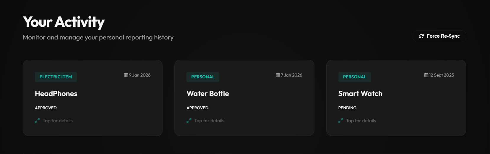

# FoundIt! Lost and Found Platform 🔍📍

FoundIt! is a sleek, modern web application designed to help communities recover lost items and return found ones. Built with a **Sleek Teal & Carbon** glassmorphism aesthetic, it provides a premium experience for both users and administrators.

## ✨ Features

- **User Dashboard**: Browse recent reports, search by keyword, and submit your own reports (lost or found).
- **Optional Image Support**: Upload photos of items to help with identification.
- **Admin Moderation**: A dedicated portal for admins to review, approve, or reject submissions.
- **Real-time Search**: Instant filtering of the global feed.
- **My Submissions**: Track your personal reports and their moderation status.
- **Responsive Design**: Elegant glassmorphism UI that works across devices.

## 📸 Visual Preview

### User Experience
| Discover Feed | Report Submission |
| :---: | :---: |
|  |  |

| My Activity | Detailed View |
| :---: | :---: |
|  |  |

### Administrative Portal


## 🛠️ Tech Stack

- **Frontend**: Vanilla HTML5, CSS3 (Custom Variables & Animations), JavaScript (ES6+).
- **Backend**: FastAPI (Python), Motor (Async MongoDB Driver).
- **Database**: 
  - **MongoDB**: Stores lost/found item metadata.
  - **SQLite**: Handles user authentication and role-based access.
- **Authentication**: JWT (JSON Web Tokens) with secure password hashing.

## 🚀 Getting Started

### Prerequisites

1.  **Python 3.10+**
2.  **MongoDB**: Ensure your local MongoDB service is running (default: `mongodb://localhost:27017`).

### Installation

1. Clone the repository:
   ```bash
   git clone <repository-url>
   cd "Lost and Found"
   ```

2. Install dependencies:
   ```bash
   pip install -r requirements.txt
   ```

### Running the App

1. Navigate to the backend directory:
   ```bash
   cd backend
   ```

2. Start the FastAPI server:
   ```bash
   uvicorn fastapi_app.main:app --reload
   ```


## 📂 Project Structure

- `backend/`: FastAPI application, routes, and database logic.
- `frontend/`: HTML, CSS, and JS files (served automatically by the backend).
- `uploads/`: Local storage for item images.


